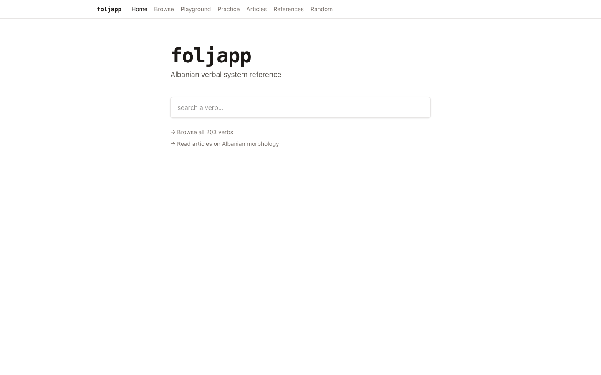
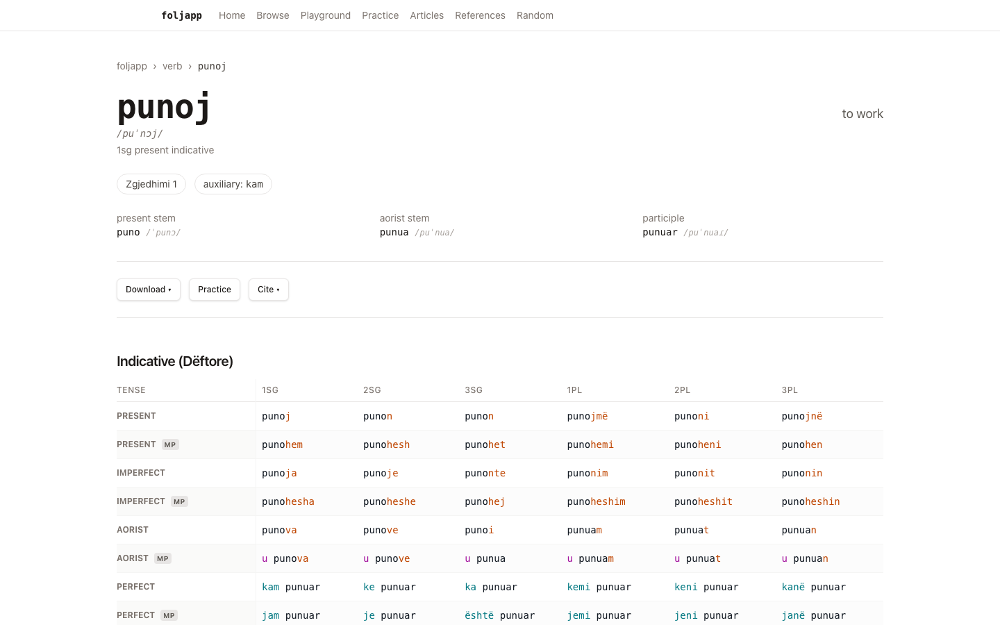

# foljapp

Albanian verbal system reference. Educational, reference-quality, academically rich.

[](https://github.com/okturan/foljapp/actions/workflows/ci.yml)
[](https://foljapp.pages.dev/)

| Search and browse | Full conjugation reference |
| --- | --- |
| [](https://foljapp.pages.dev/) | [](https://foljapp.pages.dev/verb/punoj) |

## Status

Pre-alpha. The web app, conjugation engine, verb corpus, reference pages,
playground, and local corpus tooling are active. The current public build is at
[foljapp.pages.dev](https://foljapp.pages.dev/).

## Layout

```
apps/web/              Next.js 15 app: UI, routes, and API handlers
packages/engine/       TypeScript Albanian morphology/conjugation engine
packages/data/         Checked-in verb data schemas and loaders
data/verbs/            Checked-in verb corpus
data/opus/             Small checked-in parallel-sentence fallback index
data/corpora/          Download ledger only; raw corpora stay in .cache/
scripts/               Narrow build/download utilities
tools/corpus-indexer/  Rust scanner for local corpus indexing
openspec/              Specs, changes, and roadmap
```

Local generated artifacts, downloaded corpora, SQLite indexes, and build caches
belong under `.cache/` and are intentionally not deployed.

## App vs Corpus Lab

`apps/`, `packages/`, `data/verbs/`, and `data/opus/examples.json` are the
website/runtime surface. They should stay small enough to build and deploy.

`data/corpora/`, `scripts/*corpus*`, and `tools/corpus-indexer/` are the local
corpus lab. They download, scan, audit, and explain large corpora from `.cache/`;
their outputs are evidence for development and future backend services, not
Cloudflare Pages assets.

## Roadmap

The full roadmap and per-capability specs live in [`openspec/`](./openspec/).
See [`openspec/config.yaml`](./openspec/config.yaml) for the project context
and 14-capability roadmap across 5 phases.

Active changes:

```
openspec list
```

## Local development

```sh
nvm use         # activates Node version pinned in .nvmrc
npm ci
npm run dev     # boots the webapp at http://localhost:3000
```

## Local corpus indexing

The website can read local sentence examples from
`.cache/corpus-local-full.sqlite`. That file is generated locally from raw
corpora and is not committed.

```sh
npm run build:corpus-targets      # generated foljapp forms to search for
npm run scan:local-corpus         # Rust generated-form classifier over downloaded corpora
npm run build:local-corpus-index  # both steps above
npm run build:corpus-candidate-cache # optional parsed-candidate cache for reruns
npm run scan:local-corpus:cached  # classifier using the complete candidate cache
npm run build:corpus-search-index # Tantivy phrase-search index from retained examples
npm run search:corpus -- --query="të punoj"
```

See [`data/corpora/README.md`](./data/corpora/README.md) for downloaded corpus
inventory and source notes, and
[`tools/corpus-indexer/README.md`](./tools/corpus-indexer/README.md) for the
Rust scanner commands.

## Quality gates

```sh
npm run typecheck   # TypeScript strict mode across all workspaces
npm run lint        # ESLint (Next.js + import-sort)
npm test            # Vitest across all workspaces
npm run build       # Next.js production build
npm run test:e2e    # Playwright E2E (requires browsers installed)
npm audit --audit-level=high
```

GitHub Actions runs the TypeScript checks, lint, unit suite, production build,
dependency audit, and Rust corpus-indexer tests with read-only permissions and
immutable action revisions.

## License

This repository currently has no license file. GitHub's platform terms permit
viewing and forking on GitHub, but no broader permission is granted to copy,
modify, or redistribute the source, corpus, or generated linguistic data.
Third-party sources and dependencies remain subject to their own terms.
